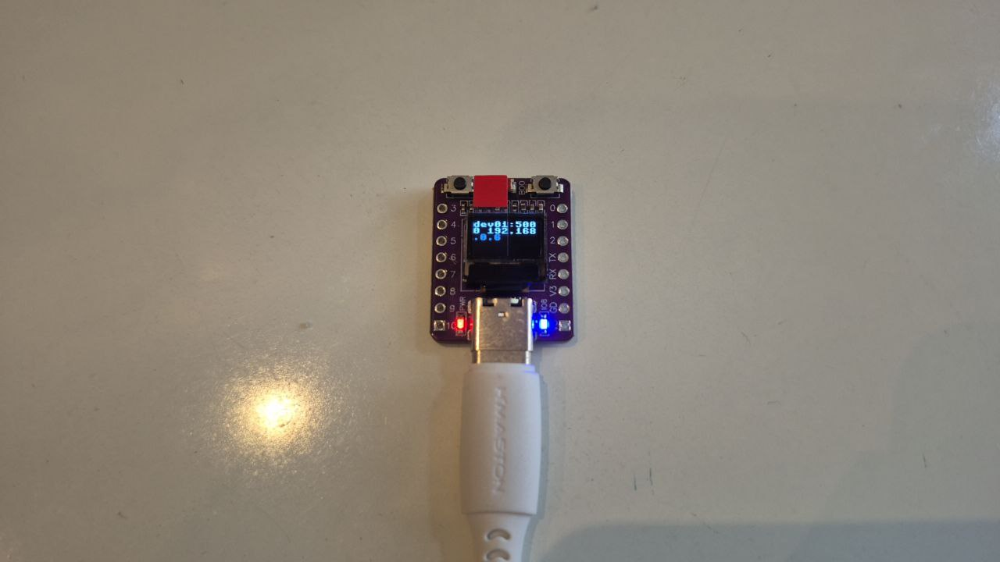

# ESP32-C3 IoT Device - Refactored Edition



## 📋 Índice

1. [O que o Dispositivo Faz](#-o-que-o-dispositivo-faz)
2. [Arquitetura Refatorada](#-arquitetura-refatorada)
3. [Como Usar](#-como-usar)
4. [Como Replicar](#-como-replicar)
5. [API Endpoints](#-api-endpoints)
6. [Estrutura do Código](#-estrutura-do-código)
7. [Troubleshooting](#-troubleshooting)

---

## 🎯 O que o Dispositivo Faz

Dispositivo IoT que se conecta ao WiFi e permite, através do navegador web:

- ✅ **Controlar LED** integrado (ligar/desligar/toggle/piscar)
- ✅ **Código Morse** via LED com display progressivo
- ✅ **Exibir mensagens** no display OLED
- ✅ **Monitorar armazenamento** (espaço em disco)
- ✅ **Acessar REPL remoto** via WebREPL (CLI Python)
- ✅ **Gerenciar arquivos** do sistema
- ✅ **API REST** completa com endpoints JSON
- ✅ **Multi-usuário** simultâneo via asyncio
- ✅ **Configuração segura** com variáveis de ambiente (.env)

---

## 🏗️ Arquitetura Refatorada

Este projeto foi **completamente refatorado** seguindo princípios de engenharia de software moderna:

### Padrões Aplicados

- ✅ **Dependency Injection** - Componentes recebem dependências explicitamente
- ✅ **Separation of Concerns** - Hardware, rede e web em camadas isoladas
- ✅ **SOLID Principles** - Single responsibility, Open-closed, Dependency inversion
- ✅ **Error Handling** - Try-catch abrangente com graceful degradation
- ✅ **Structured Logging** - Sistema de logs com níveis e timestamps
- ✅ **Hardware Abstraction** - LEDs e displays com interfaces limpas
- ✅ **Configuration Management** - Credenciais em .env (não no código)
- ✅ **Type Hints** - Documentação através de tipos Python

### Estrutura de Pastas

```
src/
├── boot.py                 # MicroPython boot script
├── main.py                 # Application entry point
├── config.py               # Configuration loader (uses .env)
├── constants.py            # System constants
├── .env                    # Credentials (gitignored)
│
├── core/                   # 🧠 Core application logic
│   ├── app.py             # Main Application class (orchestrator)
│   └── logger.py          # Structured logging system
│
├── hardware/               # 🔧 Hardware abstraction layer
│   ├── led.py             # LED control (supports active-low)
│   ├── display.py         # OLED display (SSD1306)
│   └── morse.py           # Morse code encoder with LED signaling
│
├── net_manager/            # 🌐 Network management
│   └── wifi_manager.py    # WiFi with retry logic
│
├── web/                    # 🌍 Web server
│   ├── server.py          # Microdot server setup
│   └── routes.py          # HTTP route handlers
│
├── lib/                    # 📚 Third-party libraries
│   ├── dotenv_micro.py    # micropython-dotenv
│   ├── microdot.py        # Async web framework
│   ├── ssd1306.mpy        # Display driver
│   └── aiorepl.mpy        # Async REPL
│
└── www/                    # 🎨 Static web assets
    ├── index.html
    ├── index.css
    └── webrepl/           # WebREPL client
```

### Fluxo de Execução

```
[ESP32 Powers On]
        ↓
boot.py → Starts WebREPL
        ↓
main.py → Creates Application instance
        ↓
Application.setup():
    1. Initialize Hardware (LED, Display)
    2. Connect to WiFi (with retry + LED feedback)
    3. Initialize Web Server (Microdot)
    4. Display status on OLED
        ↓
Application.run():
    ├─ Web Server (async task on port 5000)
    └─ aiorepl (async task - REPL prompt)
        ↓
[Event Loop runs until shutdown]
```

---

## 🚀 Como Usar

### 1. Configuração Inicial

**Antes de ligar o dispositivo**, configure suas credenciais WiFi:

1. Edite o arquivo `src/.env`:
   ```env
   WIFI_SSID=sua_rede
   WIFI_PASSWORD=sua_senha
   HOSTNAME=dv01
   ```

2. Faça upload para o ESP32 (veja seção [Como Replicar](#-como-replicar))

### 2. Ligando o Dispositivo

1. **Conecte o ESP32** via USB (carregador ou computador)
2. **Aguarde ~10 segundos** - LED piscando indica tentativa de conexão
3. **LED apaga** quando conectado com sucesso
4. **Display mostra**: `dv01:5000 192.168.x.x`

### 3. Acessando via Navegador

Abra o navegador e acesse:

```
http://dv01.local:5000
```

Ou use o IP mostrado no display:
```
http://192.168.x.x:5000
```

**Interface Web**:
- Página principal com informações do dispositivo
- Links para controle de LED e display
- Acesso ao WebREPL

### 4. WebREPL (REPL Remoto)

Para acessar o Python interativo remotamente:

1. Acesse: `http://dv01.local:5000/www/webrepl/webrepl.html`
2. Clique em **"Connect"**
3. Digite a senha: `star`
4. Pronto! Você tem acesso ao REPL do ESP32

---

## 🔧 Como Replicar

### Materiais Necessários

- **ESP32-C3 Supermini** com display OLED 0.42" integrado
- Cabo USB para dados
- Computador com Python 3.7+

### Passo 1: Configuração do Ambiente

#### Windows:

```powershell
# 1. Clone o repositório
git clone https://github.com/Holdrulff/computacao-fisica-esp32-c3.git
cd computacao-fisica-esp32-c3

# 2. Crie ambiente virtual e instale dependências
python -m venv venv
venv\Scripts\activate
pip install -r requirements.txt
```

#### Linux/Mac:

```bash
# 1. Clone o repositório
git clone https://github.com/Holdrulff/computacao-fisica-esp32-c3.git
cd computacao-fisica-esp32-c3

# 2. Crie ambiente virtual e instale dependências
python3 -m venv venv
source venv/bin/activate
pip install -r requirements.txt
```

### Passo 2: Flash do MicroPython

#### Windows:

```powershell
esptool --port COM3 erase_flash
esptool --port COM3 write_flash 0 firmware/ESP32_GENERIC_C3-20251209-v1.27.0.bin
```

#### Linux/Mac:

```bash
esptool.py --port /dev/ttyACM0 erase_flash
esptool.py --port /dev/ttyACM0 write_flash 0 firmware/ESP32_GENERIC_C3-20251209-v1.27.0.bin
```

### Passo 3: Configurar Credenciais WiFi

Edite o arquivo `src/.env` com suas credenciais:

```env
WIFI_SSID=sua_rede
WIFI_PASSWORD=sua_senha
HOSTNAME=dv01
```

### Passo 4: Deploy do Código

O projeto inclui scripts automatizados de deploy que:
- ✅ Auto-detectam a porta serial do ESP32
- ✅ Limpam o dispositivo completamente
- ✅ Copiam toda a estrutura de `src/` mantendo diretórios
- ✅ Verificam o resultado do deploy

#### Uso Rápido:

```bash
# Windows PowerShell/CMD
python deploy.py

# Linux/Mac ou Git Bash
./deploy.sh

# Com porta específica
python deploy.py COM3
```

O script irá:
1. Conectar ao ESP32 (auto-detecta porta ou usa a especificada)
2. Listar arquivos atuais no dispositivo
3. Pedir confirmação para limpar (⚠️ deleta TUDO!)
4. Copiar todos os arquivos de `src/` para o ESP32
5. Verificar e mostrar o resultado

**Estrutura copiada:**

```
src/boot.py          → :/boot.py (raiz do ESP32)
src/main.py          → :/main.py
src/core/app.py      → :/core/app.py (mantém pastas)
src/hardware/led.py  → :/hardware/led.py
```

---

## 🔍 Troubleshooting de Deploy

### Porta não detectada

```bash
# Liste portas disponíveis
mpremote connect list

# Use porta específica
python deploy.py COM3
```

### Erro de permissão (Linux)

```bash
sudo usermod -a -G dialout $USER
# Faça logout e login novamente
```

### Dispositivo não responde

1. Desconecte e reconecte o cabo USB
2. Pressione o botão RESET no ESP32
3. Feche outros programas usando a porta serial (Thonny, IDE, etc.)

### Comandos Úteis

```bash
# Resetar ESP32
mpremote connect COM3 reset

# Acessar REPL interativo
mpremote connect COM3 repl

# Listar arquivos no dispositivo
mpremote connect COM3 fs ls

# Ver conteúdo de arquivo
mpremote connect COM3 fs cat boot.py
```

## 📡 API Endpoints

**Health & Status**

| Endpoint | Método | Descrição | Resposta |
|----------|--------|-----------|----------|
| `/hello` | GET | Ping simples | `{"message": "Hello from dv01.local", "status": "ok"}` |
| `/health` | GET | Status completo do sistema | JSON com rede, hardware, display |
| `/storage` | GET | Informações de armazenamento | JSON com total, usado, livre (MB e bytes) |

**Exemplo `/health`:**
```json
{
  "status": "healthy",
  "hostname": "dv01",
  "network": {
    "connected": true,
    "ssid": "sua_rede",
    "ip": "192.168.1.100"
  },
  "hardware": {
    "led": {"available": true, "state": "off"},
    "display": {"available": true}
  }
}
```

**Exemplo `/storage`:**
```json
{
  "total": 1572864,
  "used": 524288,
  "free": 1048576,
  "used_percent": 33.33,
  "total_mb": 1.5,
  "used_mb": 0.5,
  "free_mb": 1.0
}
```

**Controle de LED**

| Endpoint | Método | Descrição | Resposta |
|----------|--------|-----------|----------|
| `/led` | GET | Status atual do LED | `{"led": "on"}` ou `{"led": "off"}` |
| `/led/on` | GET | Liga o LED | `{"led": "on"}` |
| `/led/off` | GET | Desliga o LED | `{"led": "off"}` |
| `/led/toggle` | GET | Alterna estado do LED | `{"led": "on"}` ou `{"led": "off"}` |
| `/led/blink` | GET | Pisca o LED N vezes | JSON com ação, count, interval, estado |

**Exemplo básico:**
```bash
curl http://dv01.local:5000/led/on
# Resposta: {"led":"on"}
```

**Exemplo blink:**
```bash
# Piscar 5 vezes com intervalo de 0.3s
curl "http://dv01.local:5000/led/blink?count=5&interval=0.3"
# Resposta: {"action":"blink","count":5,"interval":0.3,"led":"off"}
```

**Parâmetros `/led/blink`:**
- `count`: Número de piscadas (padrão: 3, limite: 1-20)
- `interval`: Intervalo em segundos (padrão: 0.5, limite: 0.1-2.0)

**Código Morse**

| Endpoint | Método | Descrição | Parâmetros |
|----------|--------|-----------|------------|
| `/morse?text=SOS` | GET | Pisca LED em Morse e mostra no display | `text` (obrigatório, máx 20 chars), `speed` (opcional, 0.1-0.5s) |
| `/morse` | POST | Pisca LED em Morse | `{"text": "SOS", "speed": 0.2}` (JSON body) |

**Exemplo GET:**
```bash
curl "http://dv01.local:5000/morse?text=SOS"
# Resposta: {"text":"SOS","morse":"... --- ...","duration":7.4,"led":"off"}
```

**Exemplo POST:**
```bash
curl -X POST http://dv01.local:5000/morse \
  -H "Content-Type: application/json" \
  -d '{"text":"HELLO"}'
# Resposta: {"text":"HELLO","morse":".... . .-.. .-.. ---","duration":12.5,"led":"off"}
```

**Funcionalidades:**
- ✅ Suporta A-Z, 0-9, pontuação (`.`, `,`, `?`, `!`, `-`)
- ✅ Display mostra cada letra progressivamente durante transmissão
- ✅ Timing padrão internacional (ITU-R M.1677-1)
- ✅ Velocidade ajustável via parâmetro `speed`

**Controle de Display**

| Endpoint | Método | Descrição | Parâmetros |
|----------|--------|-----------|------------|
| `/message` | GET | Lê mensagem atual | - |
| `/message?text=Hello` | GET | Define mensagem | `text` (query param) |
| `/message` | POST | Define mensagem | `{"text": "Hello"}` (JSON body) |

**Exemplo GET:**
```bash
curl "http://dv01.local:5000/message?text=Hello%20World"
# Resposta: {"message": "Hello World", "displayed": true}
```

**Exemplo POST:**
```bash
curl -X POST http://dv01.local:5000/message \
  -H "Content-Type: application/json" \
  -d '{"text":"Hello World"}'
# Resposta: {"message": "Hello World", "displayed": true}
```

**Arquivos Estáticos**

| Endpoint | Descrição |
|----------|-----------|
| `/` | Página principal (index.html) |
| `/www/<path>` | Arquivos estáticos |
| `/www/webrepl/webrepl.html` | Cliente WebREPL |

---

## 📚 Estrutura do Código

### Dependency Injection Pattern

O projeto usa **injeção de dependências** para facilitar testes e manutenção:

```python
# ❌ Antes (global state):
import config
config.led.on()

# ✅ Depois (dependency injection):
class Application:
    def __init__(self, wifi_ssid, wifi_password, hostname):
        self.led = LED(pin=8, inverted=True)
        self.display = Display(scl=6, sda=5)
        self.wifi = WiFiManager(wifi_ssid, wifi_password, hostname)
```

**Benefícios:**
- ✅ Testável (fácil criar mocks)
- ✅ Explícito (claro quais dependências cada classe precisa)
- ✅ Flexível (fácil trocar implementações)

### Hardware Abstraction Layer

**LED com suporte a Active-Low:**

```python
# O hardware do ESP32-C3 tem LED active-low (invertido)
# on() → pin.off() → LED acende
# off() → pin.on() → LED apaga

led = LED(pin=8, inverted=True)
led.on()   # ✅ Acende (abstração corrige a inversão)
led.off()  # ✅ Apaga
```

**Display com Graceful Degradation:**

```python
display = Display(scl=6, sda=5)

if display.is_available:
    display.show_message("Hello")
else:
    logger.warning("Display not available")
    # Aplicação continua funcionando!
```

### Structured Logging

```python
from core.logger import get_logger, LogLevel

logger = get_logger('MyModule', LogLevel.INFO)

logger.debug("Detalhes técnicos")
logger.info("Informação geral")
logger.warning("Aviso importante")
logger.error("Erro recuperável")
logger.critical("Erro fatal")
```

**Output:**
```
[123.456] INFO  [WiFi] WiFi connected successfully
[124.789] DEBUG [LED] LED turned ON
[125.123] ERROR [Display] Failed to initialize: timeout
```

### Configuration Management

**Antes (hardcoded - INSEGURO):**
```python
WIFI_SSID = "minha_rede"      # ❌ Exposto no código
WIFI_PASSWORD = "senha123"     # ❌ Commitado no git
```

**Depois (.env - SEGURO):**
```python
# src/.env (gitignored)
WIFI_SSID=minha_rede
WIFI_PASSWORD=senha123

# src/config.py
from dotenv_micro import load_dotenv, get_env

load_dotenv('.env')
WIFI_SSID = get_env('WIFI_SSID')
WIFI_PASSWORD = get_env('WIFI_PASSWORD')
```

---

## 🛠️ Troubleshooting

### LED funciona ao contrário

**Sintoma**: `/led/on` apaga o LED, `/led/off` acende.

**Causa**: LED é active-low (comum em placas ESP32).

**Solução**: Edite `src/constants.py`:
```python
LED_INVERTED = True  # ✅ Já está configurado
```

### Display não funciona

**Sintoma**: Display não mostra nada.

**Causa**: Display não conectado ou endereço I2C errado.

**Solução**:
1. Verifique conexões físicas (SCL=6, SDA=5)
2. Teste no REPL:
   ```python
   from machine import I2C, Pin
   i2c = I2C(0, scl=Pin(6), sda=Pin(5))
   i2c.scan()  # Deve retornar [60] (0x3C)
   ```
3. Aplicação continua funcionando mesmo sem display

### WiFi não conecta

**Sintoma**: LED fica piscando, nunca apaga.

**Soluções**:
1. **Verifique `.env`**: Credenciais corretas?
2. **2.4GHz obrigatório**: ESP32 não suporta 5GHz
3. **iPhone hotspot**: Ative "Maximizar Compatibilidade"
4. **Scan de redes**:
   ```python
   # No REPL
   import network
   wlan = network.WLAN(network.STA_IF)
   wlan.active(True)
   wlan.scan()  # Lista redes disponíveis
   ```

### WebREPL não conecta

**Sintoma**: Erro "WebSocket connection failed".

**Soluções**:
1. Verifique se WebREPL está rodando:
   ```bash
   mpremote connect COM3
   # No REPL: import webrepl; webrepl.start()
   ```
2. Use WebSocket na porta **8266** (não 5000):
   ```
   ws://192.168.x.x:8266/
   ```
3. Senha padrão: `star`

### Erro "ImportError: no module named 'network.wifi_manager'"

**Causa**: Conflito com módulo built-in `network` do MicroPython.

**Solução**: ✅ Já corrigido - pasta renomeada para `net_manager`

### ESP32 não reseta após upload

**Solução**:
```bash
# Reset manual
mpremote connect COM3 exec "import machine; machine.reset()"

# Ou pressione o botão RESET físico na placa
```

---

## 🔐 Segurança

### Práticas Implementadas

✅ Credenciais em `.env` (não commitadas)
✅ `.gitignore` protege arquivos sensíveis
✅ Validação de entrada (prevenção de directory traversal)
✅ Validação de parâmetros com limites (count, interval, speed, text length)
✅ Sanitização de caracteres em Morse (apenas suportados)
✅ WebREPL com senha
✅ Sem hardcoded secrets no código
✅ Rate limiting implícito (limites de operação por request)

### Recomendações

- 🔒 Troque senha do WebREPL em produção
- 🔒 Use redes WiFi com WPA2/WPA3
- 🔒 Não exponha porta 5000 para internet pública
- 🔒 Faça backup do `.env` de forma segura

---

## 🎓 Características Notáveis

### Hardware

- **ESP32-C3 Supermini** com display OLED 0.42" (72x40px)
- **Display**: SSD1306, I2C (SCL=6, SDA=5, addr=0x3C)
- **LED**: Pino 8 (GPIO8), **active-low** (invertido)
- **WiFi**: 2.4GHz apenas (802.11 b/g/n)

### Software

- **MicroPython v1.27.0** (ESP32-C3)
- **Async/await**: `asyncio` para concorrência
- **Microdot**: Web framework assíncrono
- **micropython-dotenv**: Gerenciamento de configuração
- **WebREPL**: Acesso remoto ao REPL Python
- **Código Morse**: Encoder ITU-R M.1677-1 com feedback visual

### Funcionalidades Avançadas

- **LED Blinking**: Controle parametrizado de piscadas
- **Morse Code Encoder**: Transmissão de texto em código Morse com display progressivo
- **Storage Monitoring**: Monitoramento de espaço em disco (total, usado, livre)
- **Progressive Display**: Atualização em tempo real durante transmissão Morse

### Arquitetura

- **Zero globals**: Dependency injection pattern
- **Layered architecture**: Core → Hardware → Network → Web
- **Error resilience**: Try-catch + graceful degradation
- **Logging**: Structured logs com timestamps
- **Type hints**: Documentação via tipos Python
- **Input validation**: Validação robusta de parâmetros (limites, tipos, sanitização)

---

## 📖 Documentação Adicional

- **[ARCHITECTURE.md](ARCHITECTURE.md)** - Arquitetura detalhada e padrões de design
- **[TESTING_GUIDE.md](TESTING_GUIDE.md)** - Como testar com .env
- **[MIGRATION_GUIDE.md](MIGRATION_GUIDE.md)** - Migração completa passo a passo
- **[micropython-dotenv/](micropython-dotenv/)** - Biblioteca de configuração

---

## 🤝 Contribuindo

Este é um projeto educacional desenvolvido para **Computação Física Aplicada (CFA)**.

Melhorias são bem-vindas:
1. Fork o projeto
2. Crie uma branch (`git checkout -b feature/melhoria`)
3. Commit suas mudanças (`git commit -m 'Add: nova feature'`)
4. Push para a branch (`git push origin feature/melhoria`)
5. Abra um Pull Request

---

## 📜 Licença

Este projeto é open-source e está disponível sob a licença MIT.

---

## 👨‍💻 Autor

**Projeto Original**: Prof. Fábio Nakano
**Refatorado por**: Wesley Fernandes - Graduando
**Instituição**: EACH-USP
**Curso**: Sistemas de Informação

---

**📌 Versão**: 2.0 (Refactored Edition)
**📅 Última atualização**: Março 2026
